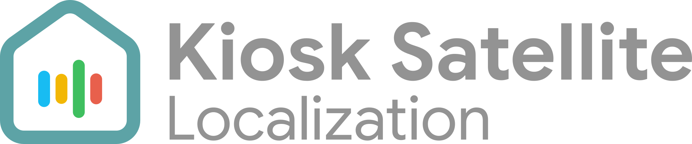

<h1 align="left">
  <picture>
    <source media="(prefers-color-scheme: dark)" srcset="assets/ks_banner_dark.svg" />
    <source media="(prefers-color-scheme: light)" srcset="assets/ks_banner_light.svg" />
    
  </picture>
</h1>

Help translate [Kiosk Satellite](https://github.com/jxlarrea/kiosk-satellite) into your language. Clear settings, helpful messages and familiar wording make the app easier for everyone to use.

A few translated labels, a better explanation or a review of someone else's work can make a difference. Small contributions and partial translations are welcome.

## Ways to help

- Add a language you speak fluently.
- Fill in missing translations or update wording when the app changes.
- Fix a typo or make an existing translation sound more natural.
- Review translations and check how they look in the app.

English and Spanish are maintained by Kiosk Satellite's author. If you spot a problem in either language, please [open an issue](https://github.com/jxlarrea/kiosk-satellite-localization/issues).

## Get started

1. Check the [issues](https://github.com/jxlarrea/kiosk-satellite-localization/issues) and [open pull requests](https://github.com/jxlarrea/kiosk-satellite-localization/pulls) for your language. For a new language, open an issue so we can coordinate the work.
2. Read the [contributor rulebook](docs/CONTRIBUTOR-RULES.md) and [contributor agreement](docs/CONTRIBUTOR-AGREEMENT.md).
3. Follow the [translation guide](docs/TRANSLATING.md), fork this repository and translate a few messages. Keep each PR focused on one language and preserve message IDs and placeholders.
4. Open a PR here with your changes. Tell us what you translated, mention anything you are unsure about and accept the agreement using the PR checkbox.

If you are new to GitHub or unsure where to begin, start with an issue telling us which language you would like to help with.

The [PR acceptance guide](docs/PR-ACCEPTANCE.md) explains the checkbox and what to do after updating your translation.

## Your contribution

Accepted translations are included in future Kiosk Satellite releases. You will receive credit under your chosen name or pseudonym in this repository and in the app when your translation ships. There is no ongoing maintenance commitment.

You keep copyright in your translations and grant Xavier Larrea exclusive worldwide usage rights under the [contributor agreement](docs/CONTRIBUTOR-AGREEMENT.md). The [repository license](LICENSE) permits translation contributions and use within Kiosk Satellite. It does not permit general reuse in other products. The [privacy notice](docs/CONTRIBUTOR-PRIVACY.md) explains how contribution records and credits are handled.

Thank you for helping more people use Kiosk Satellite in their own language.
